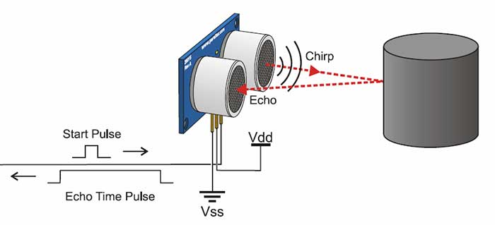
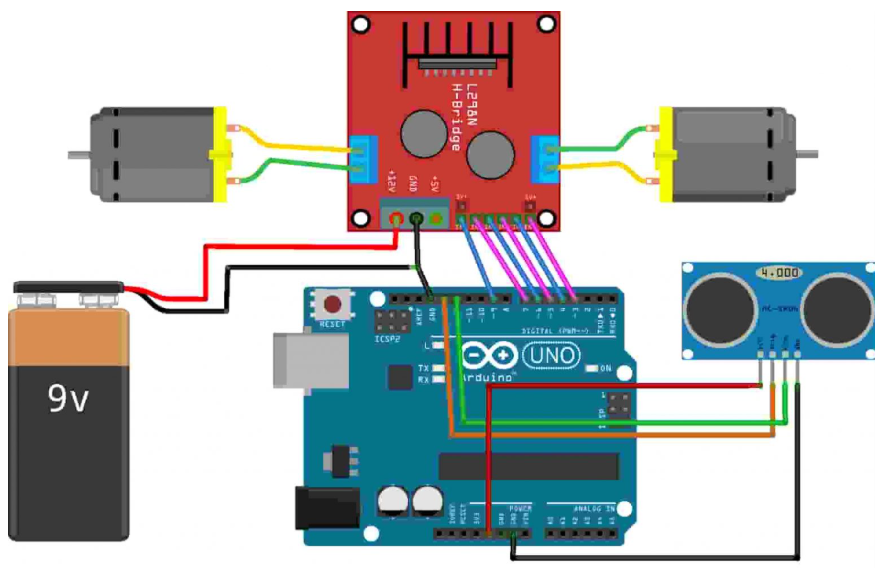
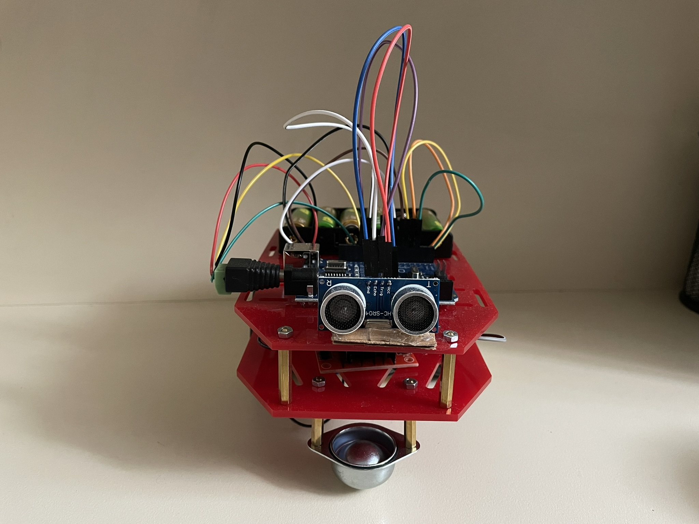
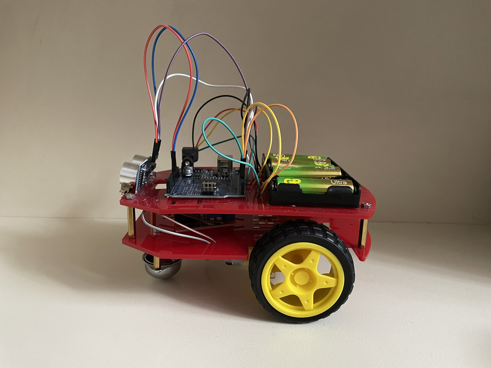
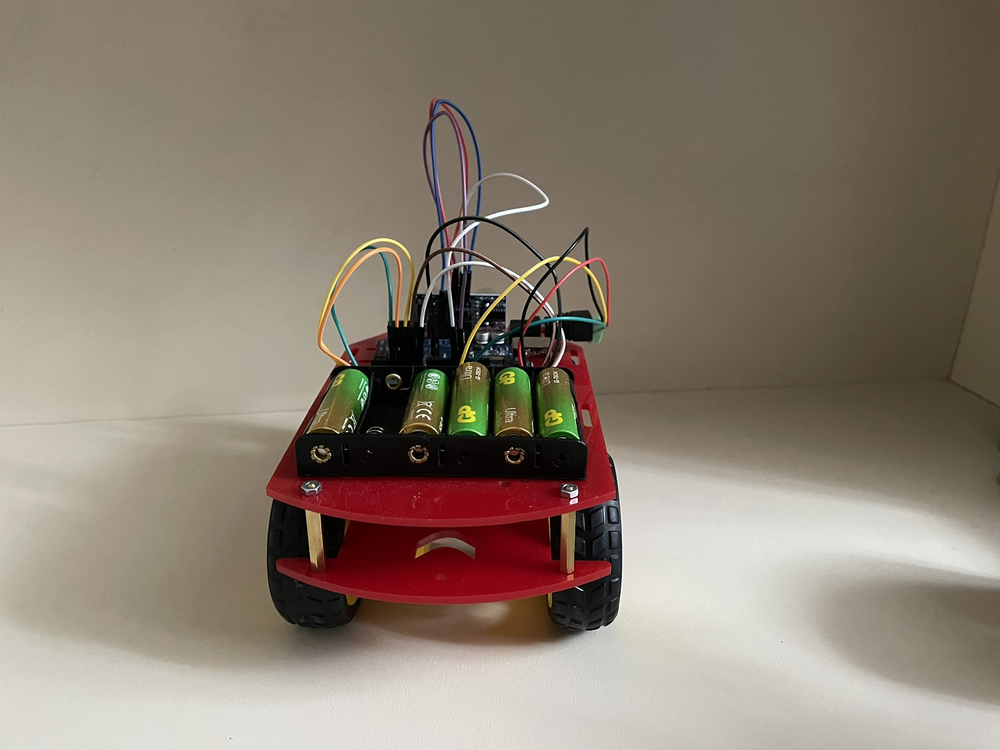
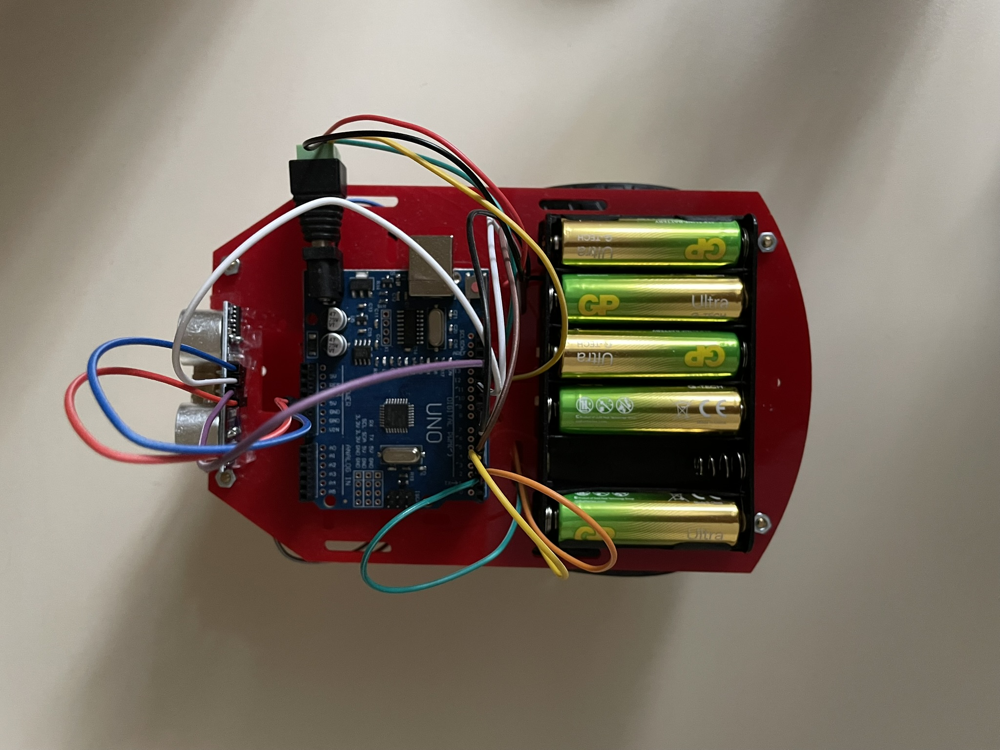
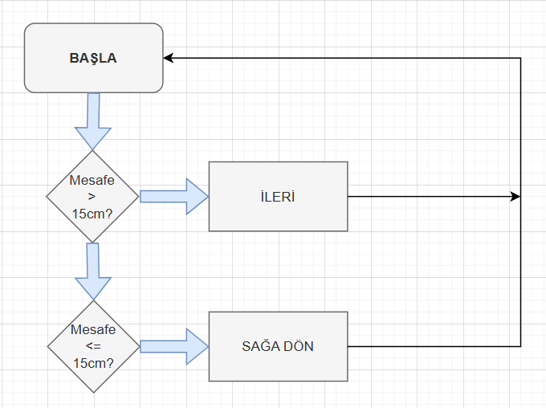

# Arduino ile Engelden Kaçan Robot Araba
> HC‑SR04 sensör ve L298N sürücü ile otonom engelden kaçış mekanizması.

---
## 📋 İçindekiler
1. [Proje Tanımı](#proje-konusu)
2. [Özet](#özet)
3. [Gerekli Malzemeler](#gerekli-malzemeler)
4. [Kullanılan Yöntemler](#kullanılan-yöntemler) 
5. [Ultrasonik Sensörün Çalışma Prensibi](#ultrasonik-sensörün-çalışma-prensibi)
6. [Yapılan Çalışmalar ve Görselleri](#yapılan-çalışmalar-ve-görselleri)
7. [Yazılım Algoritması](#yazılım-algoritması)
8. [Arduino Kod Örneği](#arduino-kod-örneği)
9. [Kurulum](#kurulum)
10. [Elde Edilen Sonuçlar](#elde-edilen-sonuçlar)
11. [Karşılaşılan Sorunlar ve Çözümler](#karşılaşılan-sorunlar-ve-çözümler)
12. [Projenin Devamında Yapılacaklar](#projenin-devamında-yapılacaklar)
13. [Kaynaklar](#kaynaklar)
---

## 1. Proje Konusu

Bu proje, Arduino Uno kontrolünde HC-SR04 ultrasonik sensör ile uzaklık ölçen ve L298N motor sürücü kartı üzerinden DC motorları yöneterek engelden kaçan bir robot araba tasarımını içerir. Klemens (terminal block) ile sensör ve motor bağlantıları daha sağlam ve düzenli yapılmıştır.  Eklenecek olan bir anahtar (switch) ile motor beslemesi sağlıklı bir şelikde açılıp kapatılabilecektir.

---
## 2. Özet

Bu rapor, Arduino Uno kontrolünde HC-SR04 ultrasonik sensör ile mesafe ölçümü ve L298N motor sürücü ile PWM kontrollü hareket komutlarının bir araya getirildiği engelden kaçan robot araba prototipinin ara aşama sonuçlarını özetler. Devre kurulumu, temel yazılım optimizasyonları ve ilk saha testleri tamamlanarak aracın engelleri algılayıp kaçma mekanizması başarıyla çalıştırılmıştır.

---
## 3. Gerekli Malzemeler

- **Arduino Uno**  
- **Çok Amaçlı Robot Platformu** (şasi ve tekerlek kitleri)  
- **L298N Voltaj Regülatörlü Çift Motor Sürücü Kartı**  
- **HC-SR04 Ultrasonik Mesafe Sensörü**  
- **6×AA Pil Yuvası** (veya Li-Po pil)  
- **Jumper Kabloları**  
- **Klemens (Terminal Block)** (sensör ve motor kabloları için)  
- **Anahtar (Switch)** (motor beslemesini açıp kapatmak için)
  ---
## 4. Kullanılan Yöntemler

- **Ultrasonik Mesafe Ölçümü**  
  HC-SR04 sensör üzerindeki `Trig` ve `Echo` pinleri ile `pulseIn()` fonksiyonu kullanılarak mesafe verisi toplandı.  
- **PWM Kontrollü Motor Sürüşü**  
  L298N sürücü üzerinden DC motorlar `analogWrite()` ile hızlandırıldı; her motor için ayrı PWM kanalı kullanıldı.  
- **Arduino IDE ve C++ Sketch**  
  Arduino Uno’ya yüklenen C++ tabanlı kodda seri iletişim (`Serial.begin`, `Serial.println`), zamanlayıcı (`delayMicroseconds`, `delay`) ve dijital/analog pin kontrolü (`digitalWrite`, `analogWrite`) uygulandı.  
- **Klemens Terminal Blokları**  
  Sensör ve motor kablolarının güvenli, modüler bağlantısı için harici klemensler kullanıldı.  
- **Güç Kaynağı ve Prototipleme**  
  6×AA pil paketi ile bağımsız besleme, breadboard ve jumper kablolarla hızlı devre prototiplemesi gerçekleştirildi.

---

## 5. Ultrasonik Sensörün Çalışma Prensibi

- `Trig` pini 10 µs süreyle HIGH yapılarak ultrasonik dalga gönderilir.  
- `Echo` pini `pulseIn()` ile yüksek kalma süresi ölçülür.  
- Mesafe (cm) = (süre / 2) / 29.1 formülüyle hesaplanır.
- Karar:
   - `< 15 cm` → geri + sağa dönüş
   - `>= 15 cm` → ileri hareket edilir.

---
## 6. 📷 Yapılan Çalışmalar ve Görselleri
**Devre Tasarımı ve Montajı**

> **Not:** Switch ve klemensi, kırmızı ile gösterilen güç hattına ekleyin.

1. **HC-SR04 Sensör**  
   - Trig → Arduino D13  
   - Echo → Arduino D12  
2. **L298N Motor Sürücü**  
   - IN1 → D7, IN2 → D6, ENA (PWM) → D9  
   - IN3 → D5, IN4 → D4, ENB (PWM) → D3  
   - Motor çıkışları → sağ ve sol DC motorlar  
3. **Güç ve Kontrol**  
   - 6×AA pil yuvası (veya Li-Po) → L298N 12 V giriş  
   - **Switch** seri olarak L298N güç hattına eklenerek motor beslemesi açılıp kapatılır  
   - **Klemens** ile sensör ve motor besleme kabloları güvenli şekilde sabitlenir 
---

**Yazılım Geliştirme ve Optimizasyon**  
  - İleri, geri ve sağa dönüş komutlarının C++ tabanlı algoritma ile kodlanması  
  - PWM sinyalleri ve `delay` süreleri ayarlanarak araç hızı kontrolünün iyileştirilmesi  
  - Seri monitör üzerinden mesafe ölçüm verilerinin doğruluğu test edildi

**Prototip Fotoğrafları**  
| Ön Görünüm                                     | Yan Görünüm                                  |
|:----------------------------------------------:|:--------------------------------------------:|
|                        |    
| Arka Görünüm                                     | Üst Görünüm                                  |
|                       |                       |

---
## 7. Yazılım Algoritması

1. Trig pini LOW → kısa bekleme  
2. Trig pini HIGH (10 µs) → LOW  
3. `pulseIn(echoPin, HIGH)` ile süre ölçümü  
4. `uzaklik < 15 cm` ise:  
   - `geri()` → 150 ms  
   - `sag()`  → 250 ms  
5. Aksi halde `ileri()`

---

## 8. Arduino Kod Örneği

```cpp
#define echoPin 12
#define trigPin 13
#define MotorR1 7
#define MotorR2 6
#define MotorRE 9
#define MotorL1 5
#define MotorL2 4
#define MotorLE 3

long sure, uzaklik;

void setup() {
  pinMode(echoPin, INPUT);
  pinMode(trigPin, OUTPUT);
  pinMode(MotorL1, OUTPUT);
  pinMode(MotorL2, OUTPUT);
  pinMode(MotorLE, OUTPUT);
  pinMode(MotorR1, OUTPUT);
  pinMode(MotorR2, OUTPUT);
  pinMode(MotorRE, OUTPUT);
  Serial.begin(9600);
}

void loop() {
  digitalWrite(trigPin, LOW);
  delayMicroseconds(5);
  digitalWrite(trigPin, HIGH);
  delayMicroseconds(10);
  digitalWrite(trigPin, LOW);
  
  sure = pulseIn(echoPin, HIGH);
  uzaklik = sure / 29.1 / 2;
  Serial.println(uzaklik);

  if (uzaklik < 15) {
    geri();
    delay(150);
    sag();
    delay(250);
  } else {
    ileri();
  }
}

void ileri() {
  digitalWrite(MotorR1, HIGH);
  digitalWrite(MotorR2, LOW);
  analogWrite(MotorRE, 150);
  digitalWrite(MotorL1, HIGH);
  digitalWrite(MotorL2, LOW);
  analogWrite(MotorLE, 150);
}

void sag() {
  digitalWrite(MotorR1, HIGH);
  digitalWrite(MotorR2, LOW);
  analogWrite(MotorRE, 0);
  digitalWrite(MotorL1, HIGH);
  digitalWrite(MotorL2, LOW);
  analogWrite(MotorLE, 150);
}

void geri() {
  digitalWrite(MotorR1, LOW);
  digitalWrite(MotorR2, HIGH);
  analogWrite(MotorRE, 150);
  digitalWrite(MotorL1, LOW);
  digitalWrite(MotorL2, HIGH);
  analogWrite(MotorLE, 150);
}
```
---

## 9. Kurulum 🛠️

1. Arduino IDE ile **Arduino Uno**’yu seçin ve uygun seri portu ayarlayın.  
2. Devreyi aşağıdaki gibi klemens kullanarak kurun:  
   - **🔩 Klemens**: Pil bağlantı kanloları ve L298N motor sürücü besleme kablolarını sabitlemek için.   
3. Arduino kodunu yükleyin.  
4. Seri Monitörü **9600 bps**’de açın.  
5. Pillerin hepsini pil yuvasına takın böylece robot çalışıyor halde olacaktır.


---

## 10. Elde Edilen Sonuçlar ✅

- **📏 Mesafe Ölçümü**: 10–80 cm aralığında ±2 cm hassasiyet elde edildi.  
- **🤖 Engelden Kaçış**: Engel algılandığında araç geri gidip 90° dönüş yaparak yeni rota sürdürdü.  


---
## 11. Karşılaşılan Sorunlar ve Çözümler

- **Pin sayısının yetersizliği**  
  Sensör ve motor sinyal pinleri birleşik gelmişti; her fonksiyon için ayrı pin kullanacak şekilde bağlantıları yeniden düzenledik.  
- **Klemens eksikliği**  
  Devrede terminal bloğu bulunmadığından harici klemens satın alıp bağlantılara ekledik.  
- **Kodun aşırı hızda çalışması**  
  Araç kontrolsüz hareket ediyordu; PWM değerleri ve `delay` sürelerini ayarlayarak hızı optimize ettik.  
- **Aracın durmama problemi**  
  Güç verildiğinde araç kendi kendine durmuyor; ileri aşamada güç hattına seri bir switch ekleyerek manuel kapama sağlayacağız.  
- **Pil ömrünün kısa olması**  
  Piller hızla boşaldı; enerji verimliliğini artırmak için yüksek kapasiteli pil veya güç yönetim devresi seçenekleri araştırılacak.
  
---
## 12. Projenin Devamında Yapılacaklar 🚀

- **🔧 Switch Entegrasyonu**: Daha ergonomik bir açma/kapama arayüzü için ekstra switch düzenlemeleri.  
- **📝 Kod Düzenleme**: Okunabilirliği artırmak ve bakımını kolaylaştırmak için refaktör.  
- **🔋 Pil Verimliliği**: Pillerin ömrünü uzatmak için güç yönetimi ve düşük güç modları denenecek.  
- **📊 Son Testler & Performans Raporu**: Tüm sistemi kapsayan kapsamlı testler yapılıp ayrıntılı performans raporu hazırlanacak.

---

## 13. Kaynaklar 📚

1. Maker Robotistan, Arduino ile Engelden Kaçan Robot Araba Yapımı : https://maker.robotistan.com/engelden-kacan-robot-yapimi/  
2. Ultrasonik Sensörün Çalışma Prensibi: https://www.bjultrasonic.com/tr/how-do-ultrasonic-sensors-work/
3. Yazılım Algoritması Çiziminde: drawio'dan yararlanıldı.


